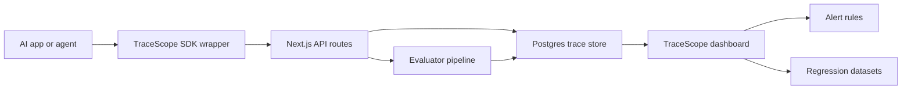

# TraceScope

TraceScope is a production-style LLM observability and reliability console for AI applications. It captures traces across prompts, model calls, retrieval, tools, structured output validation, evaluator results, cost, latency, errors, and user feedback.

The project is designed as a recruiter-facing AI engineering portfolio piece: it shows observability, LLMOps, RAG debugging, eval pipelines, cost and latency tradeoffs, and OpenTelemetry-inspired trace/span modeling instead of a generic prompt wrapper.

## Features

- Dashboard for request volume, latency, token cost, error rate, eval pass rate, and hallucination risk.
- Trace explorer with model, environment, cost, latency, token count, tags, status, and eval score.
- Trace detail page with a restrained 3D execution topology using React Three Fiber.
- RAG inspection for retrieved chunks, similarity scores, source documents, citation coverage, and missing-context signals.
- Evaluation engine for groundedness, relevance, citation support, schema validity, safety, tool correctness, latency, and cost.
- Prompt/model experiments with quality, latency, and cost deltas.
- Regression dataset seeded from bad production traces.
- Alert rules for hallucination risk, latency spikes, cost spikes, schema failures, and retrieval quality drops.
- Integration docs with Python and TypeScript instrumentation examples.

## Architecture



## Tech Stack

- Next.js 15 App Router, React 19, TypeScript
- Tailwind CSS 4
- React Three Fiber, Drei, Three.js
- Recharts for dashboard visualizations
- Next.js API routes for ingestion and eval execution stubs
- Prisma schema for the production Postgres data model
- Vitest tests for evaluator logic
- GitHub Actions workflow for lint, tests, and build

## Data Model

The production schema is in `prisma/schema.prisma` and covers users, workspaces, projects, traces, spans, prompts, retrieval chunks, eval results, feedback, eval datasets, eval runs, and alert rules.

The app currently uses realistic seeded telemetry in `src/lib/demo-data.ts` so the dashboard is impressive without production traffic.

## How Evals Work

Evaluator helpers live in `src/lib/evaluators.ts`. The current gates score groundedness, answer relevance, citation support, JSON/schema validity, safety risk, tool-call correctness, latency budget, and cost budget.

Bad traces can be promoted into regression datasets so future prompt, model, retrieval, or tool-policy changes can be blocked before they ship.

## Local Setup

```bash
npm install
npm run dev
```

Open `http://localhost:3000/dashboard`.

Optional Postgres service:

```bash
docker compose up -d
```

Create a local env file from `.env.example` if you wire the API routes to a real database.

## Quality Gates

```bash
npm run lint
npm test
npm run build
```

The GitHub Actions workflow in `.github/workflows/evals.yml` runs the same commands.

## Resume Bullets

- Built TraceScope, an LLM observability platform for monitoring prompts, tool calls, RAG retrieval, latency, token cost, and eval quality across production AI workflows.
- Designed an OpenTelemetry-inspired trace/span schema for LLM applications with support for model calls, retrieval chunks, tool calls, evaluator outputs, and user feedback.
- Implemented automated eval pipelines for groundedness, citation support, schema validity, relevance, latency, and cost regression testing.
- Built a 3D trace topology viewer using React Three Fiber to visualize agent/RAG execution paths and failure points.

## What I Would Improve Next

- Persist traces to Postgres through Prisma and add workspace auth.
- Add real OpenTelemetry export/import support.
- Add Playwright screenshots to README after deployment.
- Wire alerts to Slack, email, or incident tools.
- Add model/provider adapters for OpenAI, LiteLLM, LangChain, and custom agents.
