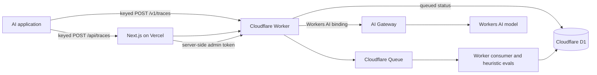

# TraceScope

TraceScope is an LLM observability console for inspecting model calls, prompts, retrieval, tools, feedback, evaluations, latency, errors, and reported usage. The public landing page is at [trscope-ai.vercel.app](https://trscope-ai.vercel.app); the console requires a workspace password.

**Rollout status:** the Cloudflare Worker is live at [tracescope-api.aryan-wagh05.workers.dev](https://tracescope-api.aryan-wagh05.workers.dev/health) with D1, Queues, and a verified Workers AI request through AI Gateway. The existing Vercel production deployment still runs the previous frontend version; its server-only environment variables and redeploy are pending Vercel access. The resume URL remains available but does not yet show Cloudflare-backed console data.

## Architecture


```mermaid
flowchart LR
  App[AI application] -->|keyed POST /v1/traces| Worker[Cloudflare Worker]
  App -->|keyed POST /api/traces| Vercel[Next.js on Vercel]
  Vercel --> Worker
  Worker -->|queued status| D1[(Cloudflare D1)]
  Worker --> Queue[Cloudflare Queue]
  Queue --> Consumer[Worker consumer and heuristic evals]
  Consumer --> D1
  Vercel -->|server-side admin token| Worker
  Worker -->|Workers AI binding| Gateway[AI Gateway]
  Gateway --> Model[Workers AI model]
```

The Next.js 15 frontend stays on Vercel to preserve the resume URL and existing landing page. The Worker is the source of truth for hosted traces, spans, retrieval chunks, eval results, feedback, ingestion keys, alert rules, dataset cases, eval runs, and settings. Vercel never sends its admin token to the browser. D1 rows persist across Worker and frontend redeploys; local JSON storage remains a development-only fallback.

## What Works

- Keyed trace ingestion at `POST /v1/traces` or the compatible `POST /api/traces` proxy. Each request is limited to 128 KiB, validated, assigned a trace ID when absent, and tracked as queued, processed, or failed.
- A Queue consumer normalizes spans and retrieval chunks, computes supported heuristic evaluations when none were supplied, and writes them to D1. Duplicate IDs with the same content are idempotent; conflicting content receives HTTP 409.
- The protected dashboard, trace explorer/detail, evals, alerts, datasets, experiments, and settings read persisted Cloudflare data. Missing provider cost, token usage, latency, and risk evidence display as unavailable rather than invented zeroes.
- The live example calls `@cf/meta/llama-3.2-1b-instruct` through the Workers AI binding with AI Gateway, records the gateway log ID, and links it to a TraceScope trace. A live request returned 117 tokens and a gateway cost of about $0.00001324; these values came from the gateway log, not a hard-coded estimate. TraceScope spans and heuristic evals are separate from AI Gateway's request/usage/cost logs.

Heuristic relevance uses text overlap, and groundedness/citation support use retrieval text. They are diagnostic signals, not semantic truth or a safety certification. Dataset runs compare cases with **observed** traces; they do not replay the model.

## Local Development

Requires Node.js 22+, npm, and Python 3 for the Python example.

1. Run `npm install` and `npm run cf:migrate:local`.
2. Create the ignored `cloudflare/.dev.vars` with `ADMIN_TOKEN=<random-long-local-value>`. Use a fresh value; do not commit it.
3. Run `npm run cf:dev`. The local Worker listens on `http://127.0.0.1:8787`. Its local config omits Workers AI, so the model example needs the deployed Worker.
4. Create `.env.local` with `TRACESCOPE_WORKER_URL=http://127.0.0.1:8787`, the same `TRACESCOPE_ADMIN_TOKEN`, a local `TRACESCOPE_CONSOLE_PASSWORD`, and a long `TRACESCOPE_SESSION_SECRET`.
5. Run `npm run dev`, open `http://localhost:3000`, unlock the console, and create an ingestion key in Settings. The key is shown only once.

Without both Cloudflare environment variables, `next dev` uses local JSON files. Production fails closed instead of silently using ephemeral Vercel storage.

## Cloudflare Deployment

The production Wrangler config is `cloudflare/wrangler.jsonc`. It requires:

| Binding or secret | Purpose |
| --- | --- |
| `DB` | D1 database named `tracescope` |
| `TRACE_QUEUE` | Queue named `tracescope-traces`, producer and consumer |
| `AI` | Workers AI binding for the gateway example |
| `ADMIN_TOKEN` | Wrangler secret; authorizes server-to-server admin routes |
| `AI_GATEWAY_ID` | Optional; defaults to the auto-created `default` gateway |

Deploy in this order:

1. Authenticate Wrangler to the intended Cloudflare account. Check plan and usage before creating resources. Run `npx wrangler d1 create tracescope --config cloudflare/wrangler.jsonc` and `npx wrangler queues create tracescope-traces --config cloudflare/wrangler.jsonc`.
2. Put the returned D1 database ID in **both** Wrangler configs. Run `npm run cf:migrate:remote`. Migrations live in `cloudflare/migrations`.
3. Run `npm run cf:deploy`, then set a fresh random `ADMIN_TOKEN` with `npx wrangler secret put ADMIN_TOKEN --config cloudflare/wrangler.jsonc`. Wrangler deploys a new Worker version when adding the secret. Do not use a previously published password or ingestion key.
4. Set Vercel server-only environment variables `TRACESCOPE_WORKER_URL`, `TRACESCOPE_ADMIN_TOKEN` (same value as the Worker secret), `TRACESCOPE_CONSOLE_PASSWORD`, and `TRACESCOPE_SESSION_SECRET`. Do **not** use a `NEXT_PUBLIC_` prefix. Redeploy the existing Vercel project, keeping its current domain.
5. Open Settings on the deployed console, create a fresh ingestion key, and revoke any old production keys. Rotate the console password and session secret if either was previously exposed.

The `default` gateway is created by Cloudflare on the first authenticated Workers AI request. The selected model is within the Workers AI Free allocation, but monitor [Workers AI usage](https://developers.cloudflare.com/workers-ai/platform/pricing/) and [Queues usage](https://developers.cloudflare.com/queues/platform/pricing/). The app caps its example at 20 calls per UTC day. Do not upgrade a plan or buy credits solely to deploy this demo.

## End-to-End Walkthrough

1. In console Settings, create an ingestion key and set `TRACESCOPE_WORKER_URL` and `TRACESCOPE_API_KEY` in your **local terminal** (never in browser JavaScript).
2. Run `python examples/send-trace.py "What is an AI trace?"`. It submits a real Workers AI request through the gateway; it prints the returned trace ID.
3. Open Traces. Watch the queued record move to a processed trace, then inspect its model span, gateway log ID when available, latency, supported usage, and heuristic evals.
4. Check Dashboard request count, trace explorer, Evals, and Settings. Add a dataset case or alert rule if desired. A second model's traces are needed for an experiment comparison.
5. Submit the same trace ID and payload twice to `/v1/traces`. The second response reports `duplicate: true`, and the dashboard count stays unchanged. Submit a changed payload with the same ID to see HTTP 409. Supply your own stable ID for retryable application requests; when absent, TraceScope assigns a new UUID-based ID.
6. Redeploy the Worker and reload the console; the D1 trace remains.

An ingestion key is for write-only submission, not console access. The workspace password protects reads and settings changes. The admin token is exclusively for the Vercel server to call the Worker.

## Queue Failures

The ingestion route first stores a queued D1 row and then enqueues its ID. If enqueueing fails, it marks the row failed and returns HTTP 503; resend the same payload/ID or use Retry in Traces. Consumer errors mark the row failed and retry up to the configured Queue limit (`max_retries: 3`). If automatic retries exhaust, the row remains failed for manual retry. D1's unique trace ID plus a request hash prevents counting a replayed message twice. A processed trace is not processed again. Failed records do not enter dashboard aggregates.

## Limits

- The hosted console uses a single workspace password, not per-user roles. Treat it as a portfolio demo, not a multi-tenant production service.
- The console currently loads trace pages through the Worker admin API and computes some aggregates in Next.js memory. Large-volume deployments need server-side aggregate queries and pagination in the UI.
- AI Gateway logs can arrive after the model response. Unknown cost or tokens stay unavailable if they are not returned by the model or gateway when the Queue consumer checks.
- The live example has no retrieval or tool calls; those fields are available to instrumented applications but are not fabricated for this workflow.
- Alert rules are evaluated when the console loads; there is no outbound Slack/email paging. Dataset runs compare existing traces and do not call a model.
- The local JSON fallback and development key are for `next dev` only. No production defaults are committed.

## Quality Gates

```bash
npm run lint
npm test
npm run build
```

The 27 tests cover validation, ingestion, persistence, duplicate delivery, queue retry, and analytics. The Worker was also verified against live D1 and Queues: two real model requests processed, malformed input returned 400, an invalid key returned 401, an oversized payload returned 413, and traces survived a Worker redeploy. The protected Vercel console still needs a production end-to-end check after frontend deployment.

## Resume Bullet

Built TraceScope's Cloudflare-backed LLM observability pipeline with keyed Worker ingestion, asynchronous Queue processing, D1 persistence, and AI Gateway correlation; built a protected Next.js console that distinguishes reported telemetry from unavailable usage. The hosted console migration is pending.
